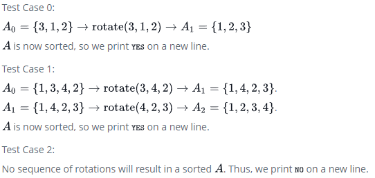

# Larry-s-Array

Larry has been given a permutation of a sequence of natural numbers incrementing from 1 as an array. He must determine whether the array can be sorted using the following operation any number of times:

Choose any **3** consecutive indices and rotate their elements in such a way that **ABC->BCA->CAB->ABC**

For example, if **A = {1, 6, 5, 2, 4, 3}:**
```
A		        rotate 
[1,6,5,2,4,3]	[6,5,2]
[1,5,2,6,4,3]	[5,2,6]
[1,2,6,5,4,3]	[5,4,3]
[1,2,6,3,5,4]	[6,3,5]
[1,2,3,5,6,4]	[5,6,4]
[1,2,3,4,5,6]

YES
```

On a new line for each test case, print **YES** if **A** can be fully sorted. Otherwise, print **NO**.

## Function Description

Complete the larrysArray function. It must return a string, either YES or NO.

larrysArray has the following parameter(s):

* A: an array of integers

## Input Format

* **A** an integer array

## Constraints
* A: array
* n: array lenght
* 3 <= n <= 1000
* 1 <= A[i] <= n
* A sorted = integers that increment by **1** from 1 to **n**

## Output format
For each test case, print **YES** if **A** can be fully sorted. Otherwise, print **NO**.

**It is required to print each of the rotations made to the array to get the final result.**

## Sample Input 1
```
[3, 1, 2]
[1, 3, 4, 2]
[1, 2, 3, 5, 4]
```

## Sample Output 1
```
YES
YES
NO
```

## Explanation

In the explanation below, the subscript of **A** denotes the number of operations performed.



## Sample Input 2
```
[1, 6, 5, 2, 3, 4]
[3, 1, 2, 4]
```

## Sample Output 2
```
NO
YES
```


